Many customer show TAMs problems with modules within the image.

There are two ways to show the customer what the image (Execution Enforcement) needs to be able to execute the playbook.

Interactive and Declarative

Let's start with the interactive way:

Access the bastion via ssh:

ssh bastion

Now we will use the ee-supported-rhel8 image.

We can get its path:

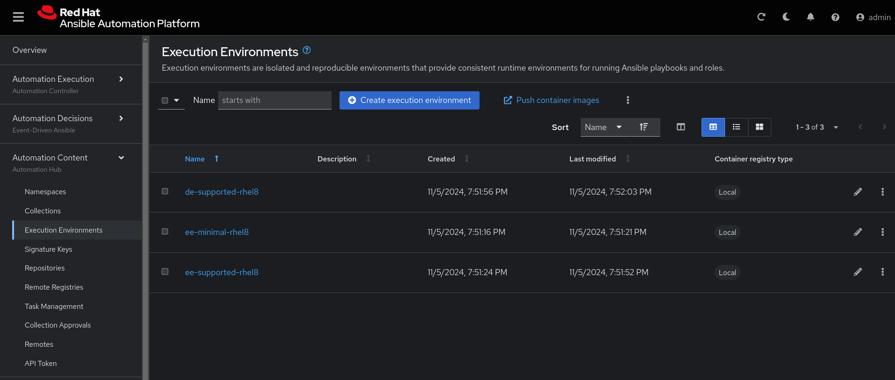

Click on ee-supported-rhel8

click on "copy to clicborad"

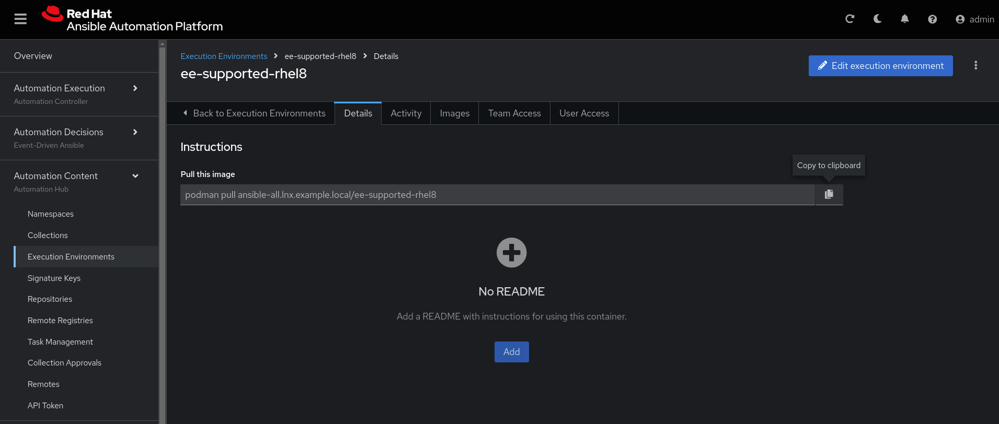

   ```bash
   podman pull ansible-all.lnx.example.local/ee-supported-rhel8
   podman run -it ansible-all.lnx.example.local/ee-supported-rhel8 bash 
   ``` 

Now inside the container:

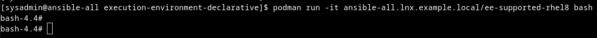

Let's create the file playbook.yml

   ```bash
   cat > playbook.yml
   ---
   - name: Get all vms
     hosts: all
     gather_facts: yes
     become: yes
   
     tasks:
       - name: Get VMs list
         community.libvirt.virt:
           command: list_vms
         register: existing_vms
   
       - name: Debug 
         ansible.builtin.debug: 
           var: existing_vms


   ```
To save the playbook.yml file "ctrl + d " on an empty line

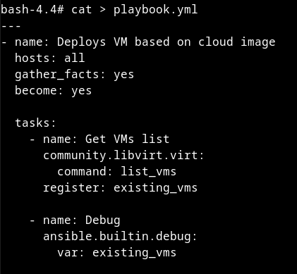

Let's generate our ssh key:

   ```bash
   ssh-keygen
   ``` 

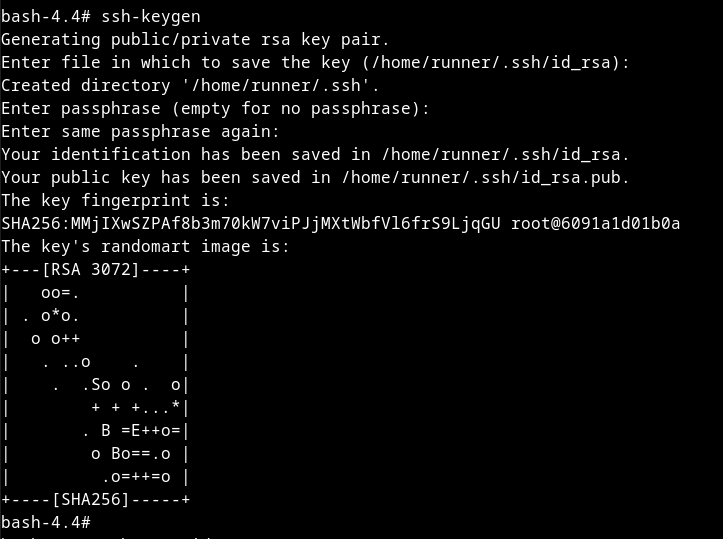

Let's copy the key to the bastion:

   ```bash
   ssh-copy-id root@172.25.5.1
   ``` 


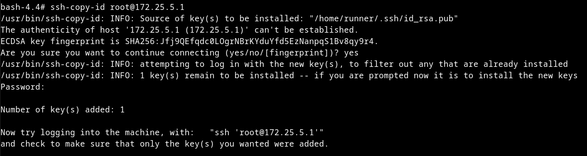

Let's create the hosts file:

   ```bash
   cat > hosts
   [all]
   bastion
   ``` 

Let's run our playbook:

   ```bash
   ansible-playbook -i hosts playbook.yml
   ``` 

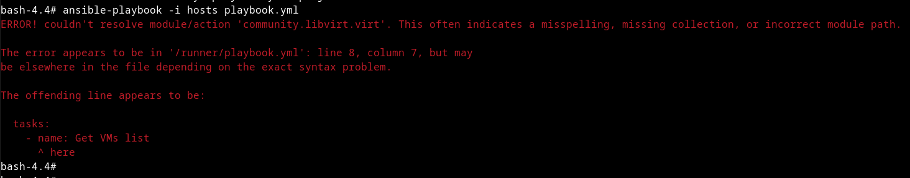

We can see from the error that we don't have the collection: community.libvirt.virt

To install:

   ```bash
   ansible-galaxy collection install community.libvirt
   ``` 

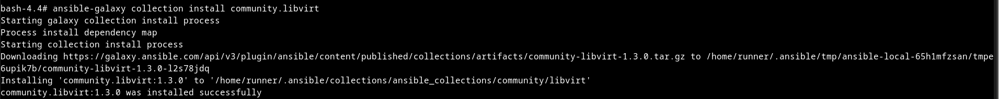

Now we can run the playbook:

   ```bash
   ansible-playbook -i hosts playbook.yml
   ``` 

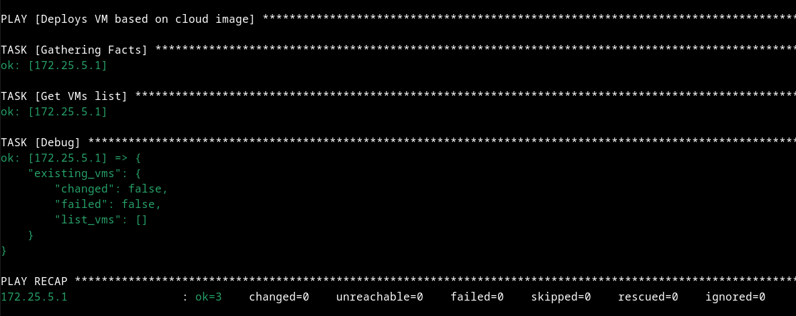

Now it works!!!!!!


Let's start in Declarative mode now:

In declarative mode. Let's create the Execution Env:

Let's create the file: execution-environment.yml

  ```yml
  vi execution-environment.yml
  ---
  version: 3
  build_arg_defaults:
    ANSIBLE_GALAXY_CLI_COLLECTION_OPTS: '--pre --ignore-certs'
  dependencies:
    ansible_core:
      package_pip: ansible-core==2.14.4
    ansible_runner:
      package_pip: ansible-runner
    galaxy: requirements.yml
    python:
      - six
      - psutil
    system: bindep.txt
    exclude:
      python:
        - docker
      system:
        - python3-Cython
        - openshift-clients
  images:
    base_image:
      name: ansible-all.lnx.example.local/ee-minimal-rhel8:latest
  
  additional_build_files:
      - src: ansible.cfg
        dest: configs
  
  additional_build_steps:
  
    prepend_galaxy:
      - COPY _build/configs/ansible.cfg /etc/ansible/ansible.cfg

  ``` 

Let's create the ansible.cfg file

O token gerar no HUB. Click em Genration token:

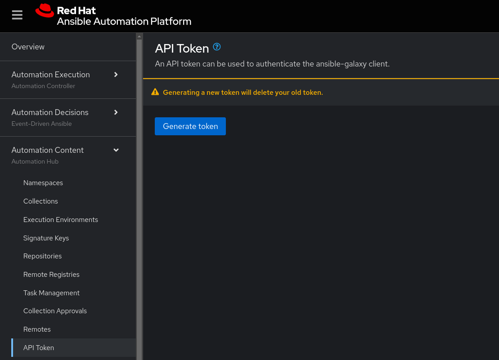

   ```yml
   vi ansible.cfg
   [galaxy]
   server_list = rh-certified, validated, community
   
   [galaxy_server.release_galaxy]
   url=https://galaxy.ansible.com/
   
   [galaxy_server.rh-certified]
   url=https://ansible-all.lnx.example.local/pulp_ansible/galaxy/rh-certified/
   token=8419da23dce1d5c1e10cd7c1f1008c57ff9b49b7
   
   
   [galaxy_server.validated]
   url=https://ansible-all.lnx.example.local/pulp_ansible/galaxy/validated/
   token=8419da23dce1d5c1e10cd7c1f1008c57ff9b49b7
   
   
   [galaxy_server.community]
   url=https://ansible-all.lnx.example.local/pulp_ansible/galaxy/community/
   token=8419da23dce1d5c1e10cd7c1f1008c57ff9b49b7
   ``` 
Vamos criar o arquivo bindep.txt

   ```yml
   vi bindep.txt
   git [platform:rpm]
   curl [platform:rpm]
   wget [platform:rpm]
   iputils [platform:rpm]
   gcc [platform:rpm] 
   systemd-devel [platform:rpm]
   python39-devel  [platform:rpm]
   
   ```

Vamos criar o arquivo requirements.yml

   ```yml 
   vi requirements.yml
   ---
   collections:
     - community.libvirt
   
   ```

Para o Hub conseguir baixar a collection. Precisamos adicionar no repositorio:

Vamos na Remotes > Edit remote:

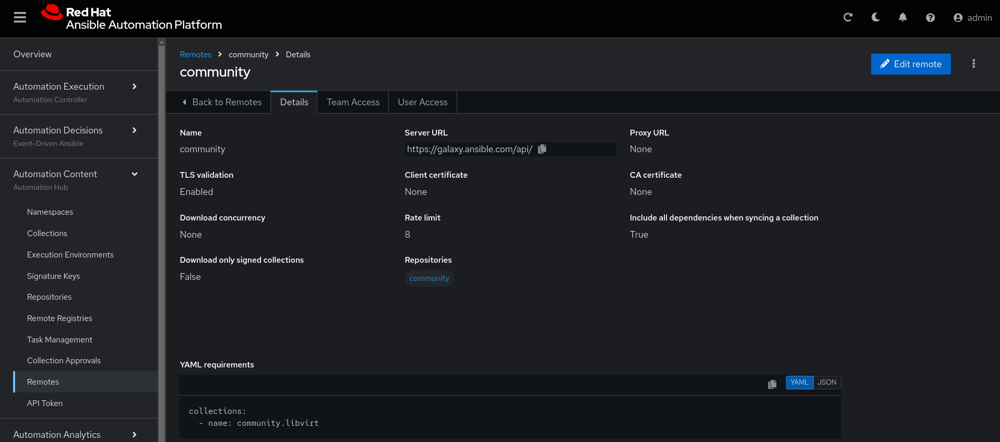


Vamos fazer o sync do Repository: 
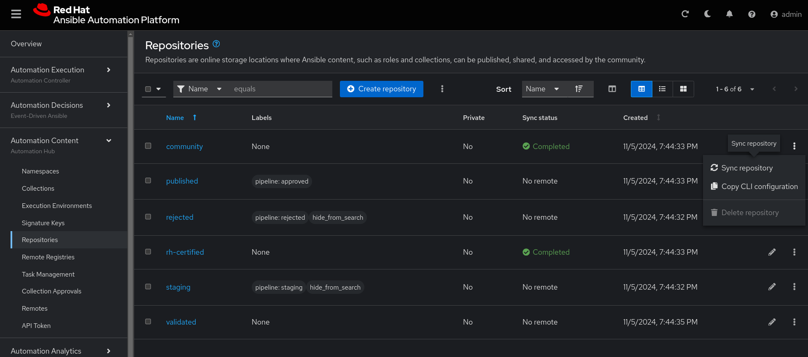

Depois que ficar como Completed:

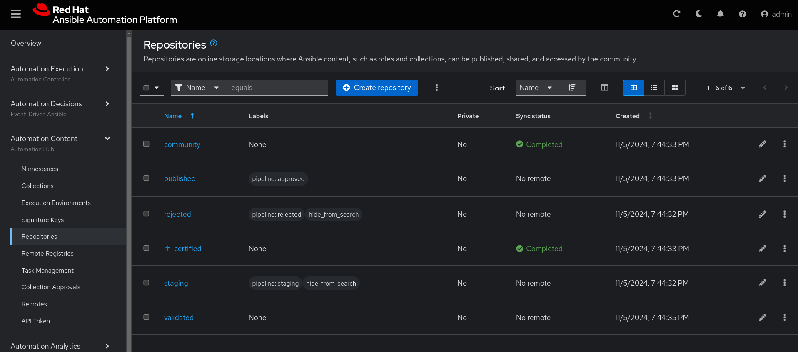

Podemos ver a collection detro do repositorio:

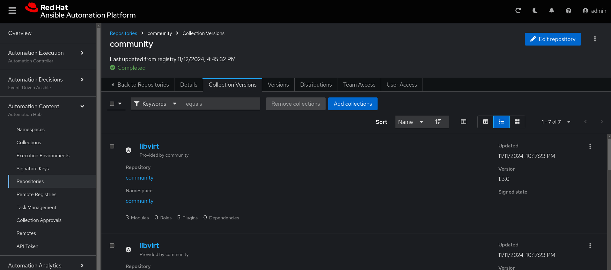

Agora para criar o Execution Environment vamos usar o comando:

   ```bash 
   ansible-builder build --tag=my-lib-virt
   
   ```

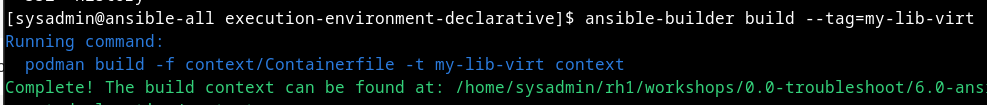

Agora dentro no bastion: 

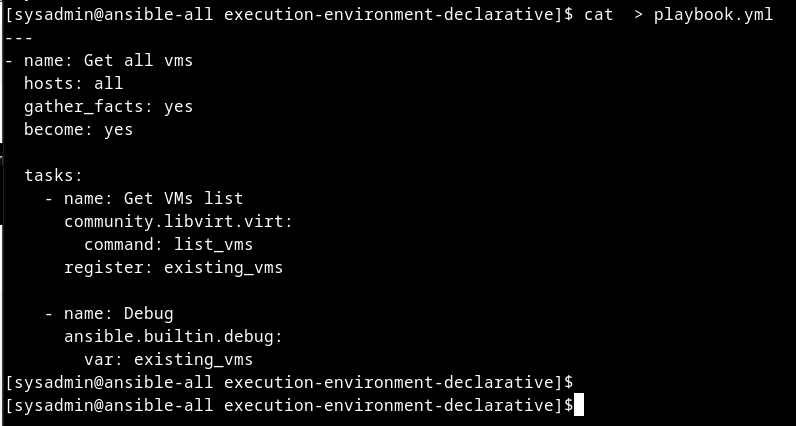

Vamos criar o arquivo playbook.yml

   ```bash
   cat > playbook.yml
   ---
   - name: Get all vms
     hosts: all
     gather_facts: yes
     become: yes
   
     tasks:
       - name: Get VMs list
         community.libvirt.virt:
           command: list_vms
         register: existing_vms
   
       - name: Debug 
         ansible.builtin.debug: 
           var: existing_vms


   ```
Para salvar o arquivo playbook.yml "ctrl + d " em uma linha vazia 


Vamos gerar nossa chave ssh: 

   ```bash
   ssh-keygen
   ``` 


Vamos copiar a chave para o bastion: 

   ```bash
   ssh-copy-id root@bastion
   ``` 


Vamos criar o arquivo hosts:

   ```bash
   cat > hosts
   [all]
   bastion
   ``` 

   ```bash
   ansible-navigator run playbook.yml   -i hosts
   ``` 

   ```yml
   vi ansible-navigator.yml
   ---
   ansible-navigator:
     execution-environment:
       container-engine: podman
       enabled: true
       image: localhost/my-lib-virt:latest
       pull:
         policy: never
     logging:
       level: critical
     mode: stdout
   
   ``` 


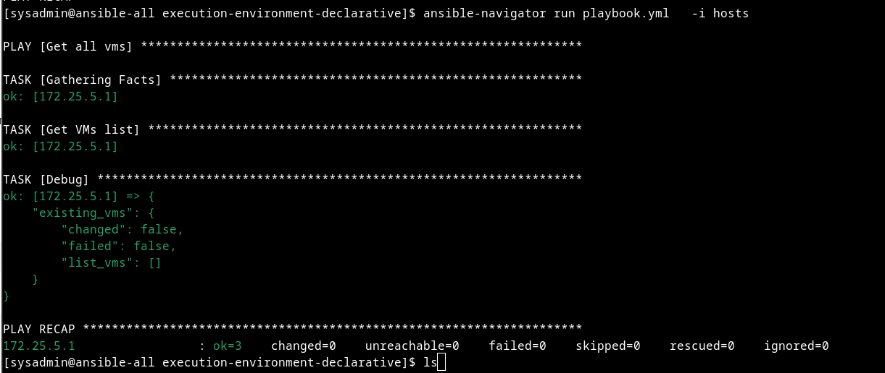